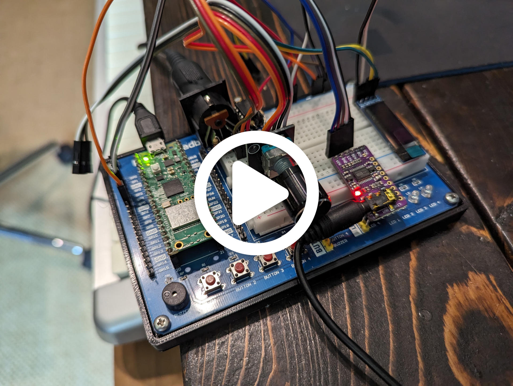

# CircuitPython synthio Monophonic Synthesizer

**NOTE**: _This project has been replaced by [pico_synth_sandbox](https://github.com/dcooperdalrymple/pico_synth_sandbox/) which implements most features that can be found here with better optimization and additional functionality. This repository will no longer receive future updates._

Parametric monophonic synthesizer built using CircuitPython's synthio module using the RP2040, UART/USB/BLE MIDI input, and I2S audio output. Controlled with a MIDI control interface or with a supported display and momentary switch rotary encoder.

## Features

* Single dual oscillator monophonic voice.
* Store patches and custom waveforms in onboard memory.
* Supports simultaneous USB, hardware (UART), and bluetooth (BLE) MIDI communication with global thru support.
* Support for compatible displays: 1602 and 1604 character lcds.
* Individual oscillator control of level, glide, tuning, pitch bend, waveform, tremolo, vibrato, and stereo panning.
* Global filter with three modes: Low-Pass, High-Pass, and Band-Pass.
* Fully configurable device settings and MIDI map.

## Requirements

* CircuitPython 8.2.0-beta.1 or greater
* All CircuitPython libraries provided

## Hardware

* [Raspberry Pi Pico W using RP2040](https://www.raspberrypi.com/products/raspberry-pi-pico/) or other compatible CircuitPython device with optional bluetooth support.
* I2S Audio Module, PCM5102A based device recommended
* 1602 or 1604 Character LCD
* KY-040 rotary encoder (or other rotary encoder with momentary switch)

## Software Compilation and Device Upload

### Linux

1. Download and install CircuitPython bootloader: [instructions & UF2 file](https://circuitpython.org/board/raspberry_pi_pico/).
2. Ensure that your device is connected and mounted as CIRCUITPYTHON and run the provided Makefile: `make` (the `--always-make` argument may be necessary to ensure that all files are forcibly uploaded to the device).

## Hardware Installation

_Coming soon..._
